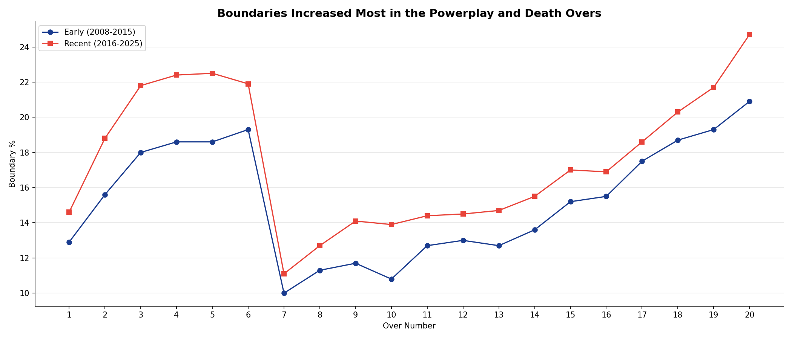
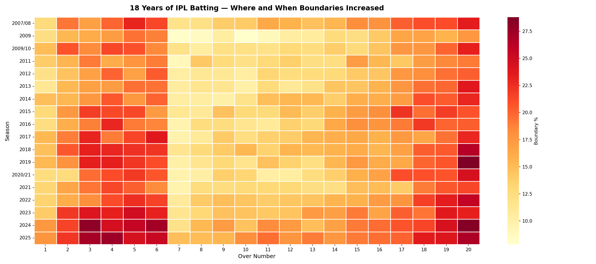
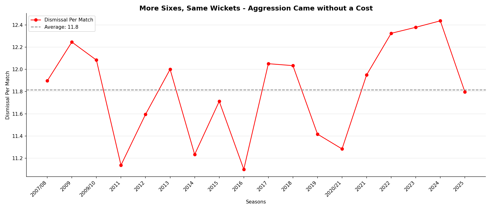
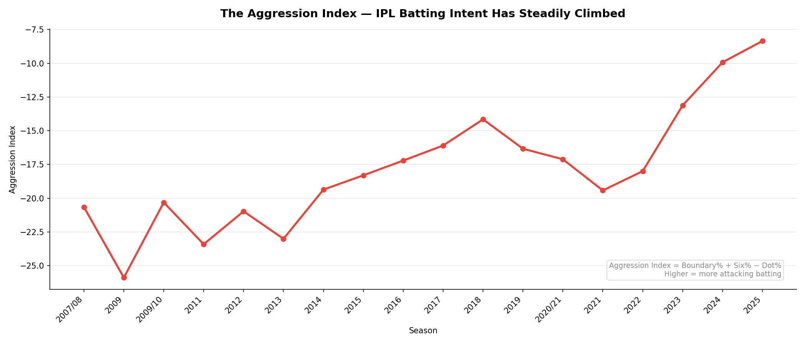

# 🏏 From Dots to Damage - How IPL Batsmen Eliminated Dead Balls
### ***ORU IPL Analytics Hackathon - Phase 1 Submission***

## The Question
The IPL has been running for 18 seasons. I wanted to know has the way batsmen score actually changed over time? And if so, where in the innings did it change the most, and did it come at a cost?

As someone who isn't a big cricket love, I don't follow cricket, I juste followed the data. Here's what it told me.

Since this analysis should be readble by anyone (including people like me who are new to cricket), here are the key terms used throughout:
- **Innings:** One teams's turn to bat. Each IPL match has 2 innings, one per team.
- **Over:** A set of 6 legal balls bowled by one bowler. Each innings has 20 overs (120 balls total).
- **Dot ball:** Any delivery where zero runs are scored. The batsman either misses, defends, or the fielder stops the ball. From the batting team's perspective, a dot ball is waster, you only get 120 balls, so every is an oppourtunity lost.
- **Boundary:** A 4 (when ball rolls to the boundary rope) or a 6 (ball flies over it).
- **Powerplay (Overs 1-6):** The opening phase where fielding restrictions limit how players can stand far from the batsman. In  theory, this should favour attacking batting but the ball is also brand new and moved more, so bowlers get early wickets here. That's why the dot ball % is highes in the powerplay, batsmen play cautiously against good bowling even though the field is in their favour.
- **Middle (Overs 7-15):** The "build" phase. Field restrictions are lifted, so the fielding team spreads out. Batsmen traditionally takes singles and rotate strike here, waiting for the occasional bad ball to hit a boundary. It's the least exciting phase.
- **Death (Overs 16-20):** The finishing phase. Batsmen go all-out because they are running out of balls. This is where the sixes pile up. Bowlers try full-length balls aimed at the batsmen's feet to limit damage.
- **Dismissal/Wicket/Getting Out:** A batsman is forced to stop batting. Common types: caught (fielder catched the ball), bowled (ball hits the stumps), LBW (leg blocks the stumps).
- **Strike Rate:** Runs scored per 100 balls, measures how fast a batsman scores.
- **Run Rate:** Runs scored per over, measures the scoring speed of a team.

## Dataset
1. **Source:** IPL ball-by-ball data (2007-2025) from Crisheet, via https://github.com/SahilGogna/IPL-Hackathon
2. **Deliveries:** 278, 205 rows - every ball bowled across 18 seasons
3. **Matches:** 1,169 rows - match-level metadata
4. **Tools used:** Python - pandas, matplotlib, seaborn

## Key Findings
1. **1. Sixes nearly doubled - fours stayled flat**
Over 18 IPL seasons, sixes per match nearly doubled from around 9 to 18, while fours per match barely changed, staying around 26-30. This tells us that batsmen aren't just scoring more, they are specifiicaly hitting more sixes. The way runs are scored has fundamentally shifted towards power hitting.

   

**2. The Fours-to-Sixes ratio callapsed**
In 2011 and 2013, there were 3 fours for every six hit. By 2024, that raio dropped to 1.7. Batsmen have shifted from finding gaps and between wickets to swinging for the boundary. In other words, the ratio of fours to sixes dropped from 3:1 in the early seasons to 1.7:1 by 2024. Batsmen used to score 3 fours for every six they hit. Now it's almost equal. This confirms that the shift isn't just about scoring more, it's about how they score. 

**3. Where did the extra runs come from? Do balls disappered.**
Looking at percentage of balls result in dots, singles, fours, and sixes, the answer is clear. In order words, dot balls dropped significantly in the poweplay (53.6% to 48.5%) and middle overs (37% to 34.3%), but slighlty increased in the death overs (32.9% to 34.2%). The powerplay saw the biggest shift, batsmen stopped defending and started attacking from ball one. The death over tells a different story, more dots alongside more sixes suggests a boom-or-bust apporach where batsmen swing for maximum power, resulting in either a six or a complete miss.

**4. The Powerplay is where the revolution happened**
Tracking the powerplay season by season reveals a clear turning point around 2016. Before that, dot balls stayed above 52% and sixes stayed below 4%. After 2016, the two lines diverge, dot balls steadily fall toward 44% while sixes climb to nearly 7% by 2025. The powerplay went from cautious phase to an attacking one.

**5. Every phase got more aggresive but the Powerplay changed the most**
All three phases of the innings show increasing runs per over, but the powerplay saw the biggest relative jump. In ealry seasons, the powerplay scored around 7 runs per over, well below the death overs at 9.5. By 2025, the powerplay reached over 9 runs per over, close to where death overs were a decade ago. The gap between phases is shrinking as batsmen atttack aggresively from the start.

**6. Over 7 - the boundary cliff that never changed**
Boundary percentage increased across most overs between the two eras, with the biggest gains in the powerplay (overs 2-6) and death overs (18-20). The over-by-over breakdown reveals that over 7 (when fielding restrictions are lifted) has been the hardest over to hit boundaries in for all 18 seasons. Everything around it got more aggreive. This is the over when fielding restrctions are lifted and the fielding team can spread their players out. It's been the hardest over to hit boundaries in for all 18 seasons, and the modern batting revolution hasn't changed that.

**7. 18 years of Boundaries in one image**
This captures the entire story in one image, boundary percentage for every over in every season. The most striking feature is the bottm-left corner turning deep red, powerplay overs in recent seasons have the highest boundary rates in IPL history. Over 7 appears as a pale stripe running from top to bottom, it has been the lowest boundary over for all 18 seasons regardless of era. The bottom-right corner also darkens, showing death overs getting more aggresive. You can literally see the batting revolution happening from top to bottom. 

**8. The Free Lunch - More Aggressive, same dismissals**
Despite all the increased aggresion, sixes doubling, dot balls dropping, boundaries increasing across the powerplay, the dismissal rate per match has stayed flat at around 12 across all 18 seasons. Batsmen aren't getting out more often even though they are swinging harder. This suggests the shift toward power hitting wasn't reckless, batsmen developed the skill to be aggreive without sacrificing their wickets.

**9. Sixes doubled, wickets didn't - side by side**
This chart overlays sixes per match (bars) with dismissals per match (line) to make the contrast undeniable. Sixes nearly doubled from ~9 to ~18 per match, while dismissals stayed flat at around 12. The two metrics moved completely independently the aggression came at no cost.

**10. The Aggressive Index - one number for 18 years of change**
The Aggressive Index that is a metric caculated by combining the boundary percentage, six percentage and the dot ball percentage into one number which shows a stead climb from -26 in 2009 to -8 in 2025. This captures the entire story of this analysis in a single line, IPL batting intent has been systematically increasing for over a decade. it's not a sudden change, it's a gradual, sustained reprogramming of how batsmen approach the game.

